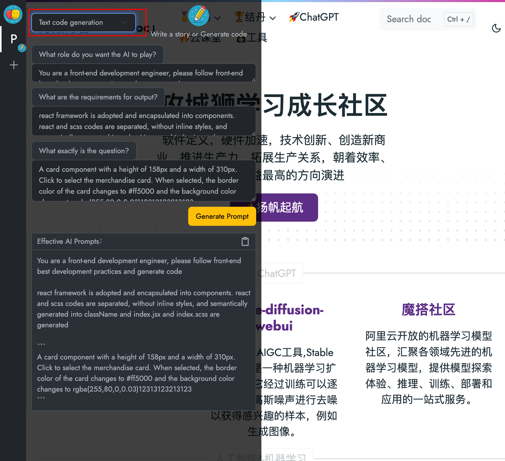

## AI Prompt - Chrome浏览器插件
chrome-plugin-ai-prompt是一款能够帮助你生成更有效的AI提示的Chrome浏览器插件。它可以为你在日常的工作、学习中提供更加智能且高效的助手，帮助你提升利用AI的工作效率和学习效果。

Propmt 参考教程：

吴恩达《ChatGPT Prompt Engineering for Developers》课程中文版，主要内容为指导开发者如何构建 Prompt 并基于 OpenAI API 构建新的、基于 LLM 的应用，包括：

> 书写 Prompt 的原则;
> 文本总结（如总结用户评论）；
> 文本推断（如情感分类、主题提取）；
> 文本转换（如翻译、自动纠错）；
> 扩展（如书写邮件）;

**英文原版地址：[ChatGPT Prompt Engineering for Developers](https://learn.deeplearning.ai)**

**中文字幕视频地址：[吴恩达 x OpenAI的Prompt Engineering课程专业翻译版](https://www.bilibili.com/video/BV1Bo4y1A7FU/?share_source=copy_web)**

**中英双语字幕下载：[《ChatGPT提示工程》非官方版中英双语字幕](https://github.com/GitHubDaily/ChatGPT-Prompt-Engineering-for-Developers-in-Chinese)**

## 安装插件
你可以通过以下方式安装AI Prompter插件：

1. 打开Chrome扩展程序的开发者模式，在扩展程序页面的右上角找到“开发者模式”开关，将其打开。
2. chrome 浏览器 打开 <chrome://extensions/>
3. 点击左上角“加载已解压扩展程序”
4. 选择本项目文件夹下的plugin目录，打开即可

## 如何使用
点击插件开启使用，在左侧菜单中

功能特点
- 支持多种AI提示类型，包括文本总结、代码生成、本地知识、AI机器人等
- 提供丰富的AI提示案例，满足不同的使用场景需求
- 支持自定义AI提示，让你的工作更加高效
- 可以与其他工具和应用程序集成，扩展使用场景
  
## todo list
- 增加在线AI预览
- 保存历史Prompts

## 开发者信息
AI Prompter是一款开源的Chrome浏览器插件，代码托管在Github上。欢迎大家一起来贡献代码，为更多人提供帮助。

## 许可证
MIT